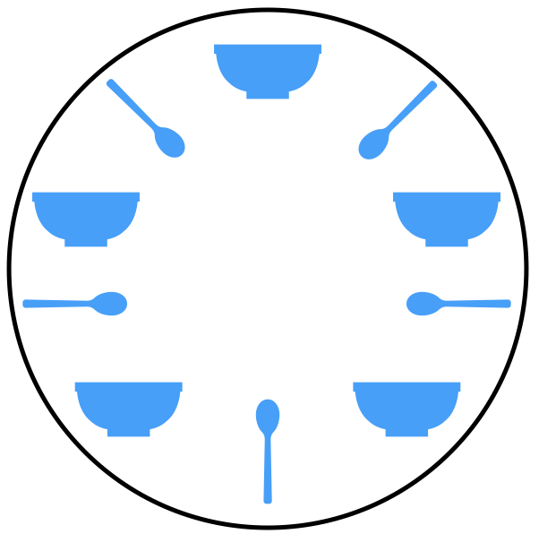

# Hungry Developers

For this project, you'll write a program that simulates five developers at a table eating. While this seems like a silly program to write, it will help you explore concurrency, synchronization, and avoiding deadlocks.

This project will help you practice the concepts learned in the Concurreny II - Fundamentals lesson of Sprint 7 in Lambda's full time iOS course. After completing the lesson material and this project, you should be able to:

- understand and explain what concurrency means, and common scenarios where it is appropriate
- understand and explain what a race condition is
- understand and use mutexes to prevent race conditions
- understand and explain what a deadlock is

## Part Zero - Challenge Description

Imagine a scenario where you have five hungry developers sitting around a round table. On the table between each pair of developers sits a spoon.



Each developer is hungry, and trying to solve a difficult programming challenge. They alternately think and eat soup. However, a developer can only eat soup when the have both the spoon to their left and the spoon to their right.

After a developer finishes eating, they must put down both spoon, so that other developers can use them. A developer can take the spoon on their left or their right as soon as they're available, but they cannot start eating before they get both spoons.

Assume that there is an unlimited supply of soup for each developer, and that they have infinitely big stomachs. In other words, they can keep eating and thinking forever. One more rule: the developers can't talk to each other. In other words, they can't know when others are waiting to eat or think.

Your goal is to write a program that simulates this scenario.

## Part One - Write A Solution

This problem is trickier than it seems. However, you should start by writing a simple solution.

1. Create a class called `Spoon`. It should have two methods, `pickUp()` and `putDown()`.
2. If `pickUp()` is called while the spoon is in use by another developer, `pickUp()` should wait until the other developer calls `putDown()`. You can implement this with a private `lock` property.
3. Create a class called `Developer`. Each `Developer` should have a `leftSpoon` property and a `rightSpoon` property. It should also have `think()`, `eat()`, and `run()` methods. 
4. `Developer.run()` should call `think()` then `eat()` over and over again forever.
5. `think()` should pick up both spoons before returning.
6. `eat()` should pause for a random amount of time before putting both spoons down. (Hint: use `usleep()` to pause for a given number of microseconds).
5. Create 5 `Spoon`s and 5 `Developer`s giving each developer a left and right spoon. Note that developers will of course share spoons. Ever developer's right spoon is the next developer's left spoon.
6. Call `run()` on each developer in a different queue/thread. You can do this with the following code assuming you put your developers in an array:

```
DispatchQueue.concurrentPerform(iterations: 5) {
	developers[$0].run()
}
```

To recap the algorithm you're writing here, each developer will:

- think until the left spoon is available; when it is, pick it up;
- think until the right spoon is available; when it is, pick it up;
- when both spoons are held, eat for a fixed amount of time;
- then, put the right spoon down;
- then, put the left spoon down;
- repeat from the beginning.

## Part Two - Test and Analyze

Will this code work OK? Is it safe from race conditions and deadlocks? Add print statements so you can track the progress of your developers. For example, in `eat()`, log when each developer starts eating, and when they finish eating. Run the program. Does it continue indefinitely? Does it hang? Make sure you run the program for a long time. Concurrency problems are non-deterministic, and may take a large number of iterations before appearing.

If you notice any problems can you explain them? Try to understand what's happening before going on to the next section.

## Part Three - Fix Any Problems

This simple solution works **most** of the time, but it can deadlock. Specifically, if each developer picks up their left spoon and is waiting to pick up their right spoon, no progress can be made. While the timing has to be just right, the program _can_ reach this state and deadlock.

How can you fix this? There are a number of solutions to this problem ranging from simple to quite complex. See if you can think of a solution, and analyze and try it before moving on to the next section.

## Part Four - Solution

Fundamentally the problem with the simple solution is that if each developer picks up the spoon to their left, each developer is holding one spoon, and they all are waiting for another spoon to become available. However, another spoon will never become available, because all the other developers are also waiting for a spoon to become available.

One simple solution to this is to assign an order or ranking to the spoons. For example, number them from 1 to 5. Then, make it so that developers will _always_ pick up the lower-numbered spoon first, before picking up the higher-numbered spoon (from among their two spoon). In this scenario, if four of the five developers pick up their lower-numbered spoon, only the highest numbered spoon (ie. spoon 5) will remain on the table, and the fifth developer will not be able to pick up a spoon, because only their _higher_-numbered spoon will be on the table. This leaves the that spoon free for another developer, thus breaking the deadlock.

Implement this solution by:

1. Add an `index` property to `Spoon`.
2. Give each spoon an index from 1 to 5.
3. Write `eat()` so that a developer will always pick up their lower-numbered spoon first. (The order in which they put them down doesn't matter.)
4. Test the app again. In theory, with this solution, the app can't deadlock. Run it until you're confident that that's true.

## Go Farther

The simple solution above will prevent deadlocks. However, it has some downsides, including poor performance in real-world scenarios where the number of resources is not known in advance. Can you think of another solution? Some ideas are below. Try implementing them.

### Waiter (Arbitrator) Solution

Another solution is to introduce a waiter to the program. In order to pick up the spoons, a developer must ask the waiter's permission. The waiter will give permission to only one developer at a time until the developer has picked up both fo their spoons. The waiter can be implemented using a mutex.

This approach also has a problem in that it reduces parallelism. In other words, it does not maximize the number of developers simultaneously eating.

### Chandy/Misra solution (message passing)

This solution is more complicated, and it actually breaks one of the rules stated above in that it requires the developers to communicate with each other. Howerver, it allows for good concurrency, fixes starvation, and doesn't require a central authority like a waiter.

1. For every pair of developers contending for a resource, create a spoon and give it to the developer with the lower ID (n for agent Pn). Each spoon can either be dirty or clean. Initially, all spoons are dirty.
2. When a developer wants to use a set of resources (i.e. eat), said developer must obtain the spoons from their contending neighbors. For all such spoons the developer does not have, they send a request message.
3. When a developer with a spoon receives a request message, they keep the spoon if it is clean, but give it up when it is dirty. If the developer sends the spoon over, they clean the spoon before doing so.
4. After a developer is done eating, all their spoons become dirty. If another developer had previously requested one of the spoons, the developer that has just finished eating cleans the spoon and sends it.

Can you implement this solution? It will require significantly more code.
